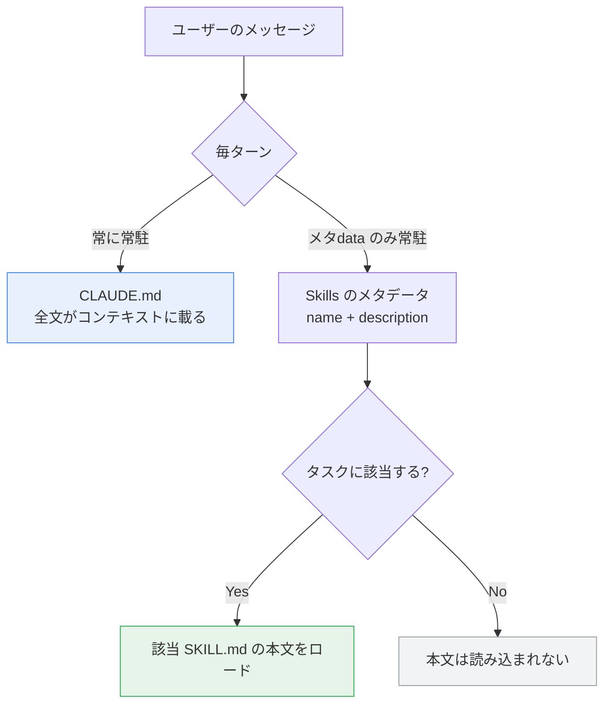
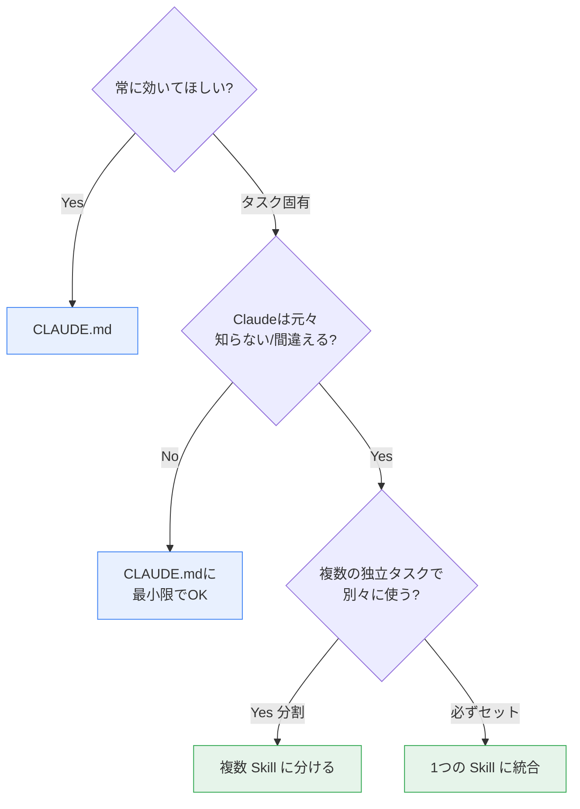
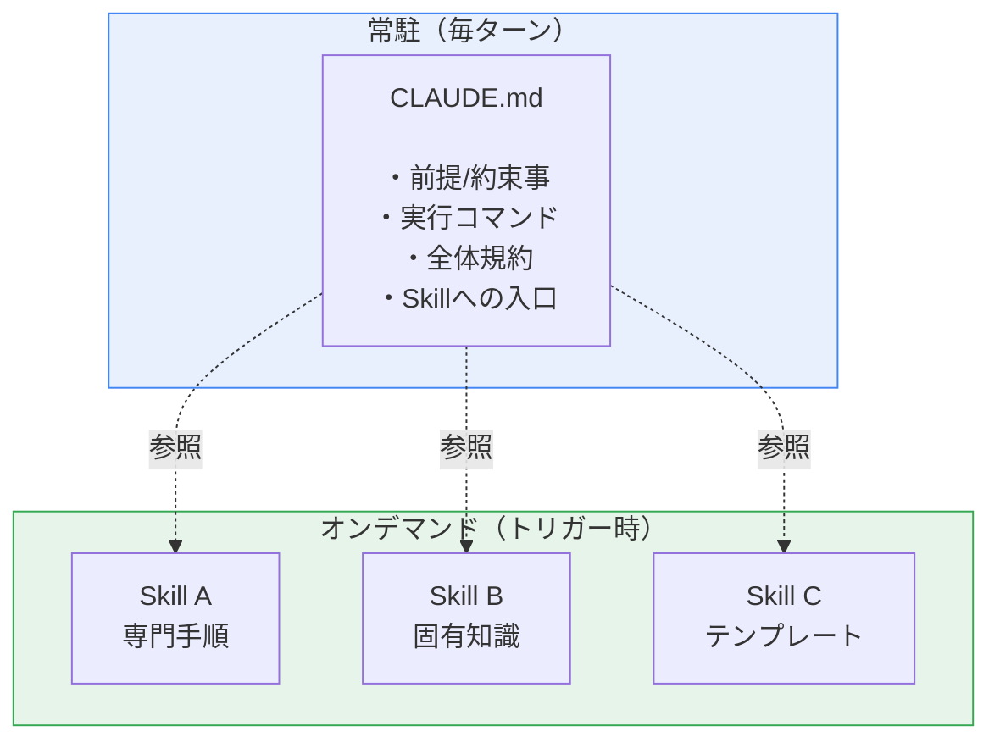

# CLAUDE.md と Skills の責務・粒度設計ガイド

> Claude Code で開発する際の `CLAUDE.md` と Skills の使い分け、および Skill をどの粒度で作るべきかの整理。

---

## 1. 結論（最初に）

> **CLAUDE.md は「このプロジェクトでの振る舞い方の前提」を常に持たせるもの。**
> **Skills は「特定の仕事をするときに開く専門マニュアル」。**

すべての違いは **「いつ読み込まれるか」** から派生する。

---

## 2. 根本の違い：読み込まれるタイミング

| | CLAUDE.md | Skills |
|---|---|---|
| 読み込み | **常時**（毎ターン常駐） | **オンデマンド**（トリガー時のみ本文ロード） |
| トークンコスト | 毎ターン消費する | メタデータのみ常駐、本文は必要時だけ |

- 「毎回必ず効いていてほしい」もの → **CLAUDE.md**
- 「特定のタスクのときだけ効けばいい」もの → **Skills**

---

## 3. 責務の対比

| 観点 | CLAUDE.md | Skills |
|---|---|---|
| 役割 | プロジェクトの**常識・前提・約束事** | 特定タスクの**専門的な手順書（playbook）** |
| 読み込み | 常時（全セッション） | オンデマンド（トリガー時のみ） |
| トークン | 毎ターン消費 | メタデータのみ常駐、本文は必要時 |
| 内容の粒度 | 高レベルの原則（**薄く**） | 手順・テンプレート・固有知識（**厚く**） |
| 比喩 | チームに渡す README / 行動規範 | 棚に並んだ作業マニュアル |
| 量の目安 | できるだけ短く（〜200行程度） | 1つ 150〜400行、責務ごとに分割 |

---

## 4. それぞれに書くべきもの

### CLAUDE.md に置く
- 使用言語・フレームワーク・パッケージマネージャ（例: `pnpm` を使う、`npm` は使わない）
- ビルド / テスト / lint の実行コマンド
- 全体に効くコーディング規約・命名規則
- やってはいけないこと（例: `main` に直 push しない）
- 各 Skill への入口的な言及（"エラー設計は `error-handling` skill を参照"）

### Skills に置く
- 特定タスクの詳細手順（例: FrameWeaver のエラー設計規約、Tauri の IPC 規約）
- テンプレート、コード例、参照資料
- Claude が**元々知らない / 間違えやすい**環境固有の知識

---

## 5. Skill の粒度設計

### 5-1. 核となる原則

公式・コミュニティが共通して挙げる考え方。Skill は **「知識のコンテナ」ではなく「知識へのポインタ」**。

| 原則 | 意味 |
|---|---|
| Single Responsibility | 1つの Skill は1つのことをうまくやる |
| Composition over Monoliths | 巨大な1つより、小さな Skill の組み合わせ |
| Reference over Duplication | 全部埋め込まず、ドキュメントや他 Skill を参照 |
| Token Efficiency | メタデータは最小限、本文は焦点を絞る |

### 5-2. サイズの目安（粒度のシグナル）

| 区分 | 行数 | 性質 |
|---|---|---|
| ✅ シンプル | 150〜250 行 | 単一目的・焦点が明確 |
| ✅ 複雑 | 250〜400 行 | 複数要素だが凝集している |
| ⚠️ 警告ゾーン | 400〜600 行 | 分割を検討すべき |
| ❌ 大きすぎ | 600 行超 | アンチパターン、要リファクタ |

> 400行を超えたら「2つの責任を持っていないか?」を疑うサイン。

### 5-3. 粒度を外さない実践プロセス（公式推奨）

最初から設計せず、**繰り返し**から抽出する。

「毎回同じことを説明している塊」が自然な粒度の境界になる。
逆に、まだ繰り返していない／将来使うか不明なものを先回りで Skill 化すると、たいてい粒度を外す。

---

## 6. 線引きの判断基準（迷ったとき）

| 問い | 判断 |
|---|---|
| 常に効いてほしい? | Yes → CLAUDE.md / タスク固有 → Skill |
| 薄い原則? / 厚い手順? | 原則 → CLAUDE.md / 手順 → Skill |
| CLAUDE.md が膨らんできた? | 詳細を Skill に押し出し、CLAUDE.md には参照だけ残す |

> **CLAUDE.md = 目次と原則、Skills = 本文** という関係に寄せるのが健全な状態。

---

## 7. 適用例（FrameWeaver: Tauri + Rust + React / Clean Architecture + VSA）

| 対象 | 置き場所 | 理由 |
|---|---|---|
| Rust + Tauri + React 構成、Clean Architecture を守る、テスト実行コマンド | **CLAUDE.md** | 全セッションで効くべき常識 |
| `frameweaver-error-handling`（BackendError/FrontendError のタグ付き union、3層判定構造） | **独立 Skill** | プロジェクト固有 + 毎回説明する塊 + 凝集している |
| Rust のレイヤー配置規約 + モジュール命名規約 | **1つの Skill に統合** | 必ずセットで参照する |
| 汎用的な React Hooks の一般論 | **Skill にしない** | Claude が既に知っている → CLAUDE.md に最小限で十分 |

---

## 8. まとめ（1枚図）

- **薄く常駐する CLAUDE.md** が原則と目次を持ち、
- **厚い Skills** がタスクごとの本文を持ち、必要時だけ開かれる。

---

## 参考リンク

- [Skill authoring best practices – Claude Docs](https://platform.claude.com/docs/en/agents-and-tools/agent-skills/best-practices)
- [Agent Skills（概要）– Claude Docs](https://platform.claude.com/docs/en/agents-and-tools/agent-skills/overview)
- [Best practices for Claude Code – Claude Code Docs](https://code.claude.com/docs/en/best-practices)
- [Claude Agent Skills: A First Principles Deep Dive（解説ブログ）](https://leehanchung.github.io/blogs/2025/10/26/claude-skills-deep-dive/)
- [Claude Code Skill Best Practices（コミュニティ版・サイズ目安の出典）](https://glama.ai/mcp/servers/@btangonan/smart_mcp/blob/902b1df000fc1175db3abe2a2984979922befeb7/docs/SKILL_BEST_PRACTICES.md)
