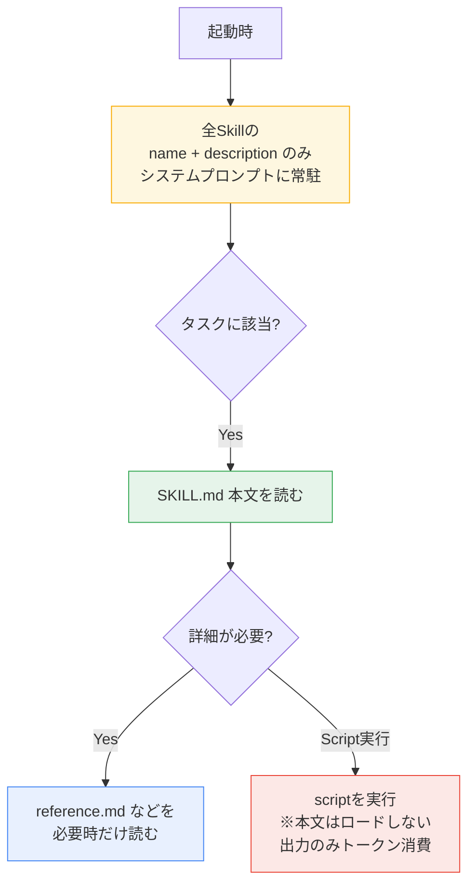
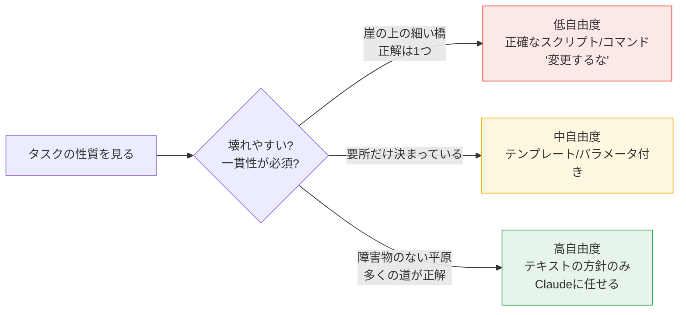
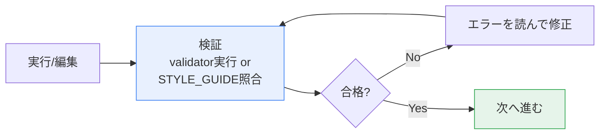
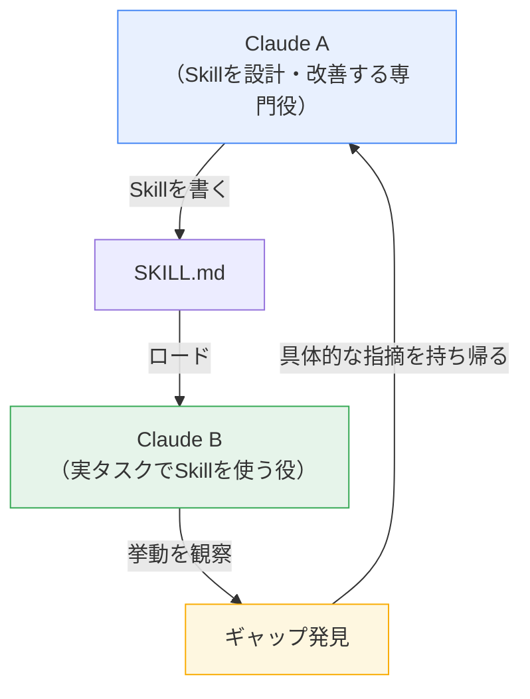

# SKILL.md の書き方ガイド

> Claude Code / Claude API で使う `SKILL.md` を効果的に書くための実践ガイド。
> 公式 "Skill authoring best practices" を基に整理。

---

## 0. 大前提：4つの核となる原則

| 原則 | 要点 |
|---|---|
| **Concise is key（簡潔第一）** | コンテキストウィンドウは共有資源。Claude は既に賢い前提で、知らない情報だけ書く |
| **Degrees of freedom（自由度の調整）** | タスクの壊れやすさに応じて指示の具体度を変える |
| **Test with all models** | 使う予定の全モデル（Haiku/Sonnet/Opus）でテストする |
| **Progressive disclosure（段階的開示）** | SKILL.md は目次。詳細は別ファイルに分け、必要時だけ読ませる |

> **判断のクセ付け**：各情報に「Claude は本当にこれを知らない?」「このトークンコストは見合うか?」と問う。

---

## 1. ファイル構造の全体像



ディレクトリ構成の例：

```
pdf-processing/
├── SKILL.md          # メイン指示（トリガー時にロード）
├── FORMS.md          # フォーム記入ガイド（必要時のみ）
├── reference.md      # APIリファレンス（必要時のみ）
├── examples.md       # 使用例（必要時のみ）
└── scripts/
    ├── analyze_form.py   # 実行される（ロードされない）
    └── fill_form.py
```

---

## 2. YAML フロントマター（必須2フィールド）

```yaml
---
name: processing-pdfs
description: Extract text and tables from PDF files, fill forms, merge documents. Use when working with PDF files or when the user mentions PDFs, forms, or document extraction.
---
```

### `name` の要件

| 項目 | ルール |
|---|---|
| 最大長 | 64文字 |
| 使える文字 | 小文字・数字・ハイフンのみ |
| 禁止 | XMLタグ、予約語（`anthropic` / `claude`） |
| 推奨形 | 動名詞（gerund）形：`processing-pdfs`, `analyzing-spreadsheets` |

```
✅ processing-pdfs / analyzing-spreadsheets / testing-code
△  pdf-processing / process-pdfs（名詞句・動詞形も可）
❌ helper / utils / tools / documents / data（曖昧・汎用すぎ）
```

### `description` の要件と書き方（最重要）

`description` は **Skill 選択の決め手**。100以上の Skill から正しいものを選ぶ判断材料になる。

| 項目 | ルール |
|---|---|
| 最大長 | 1024文字 |
| 必須 | 空でないこと |
| 禁止 | XMLタグ |
| **視点** | **必ず三人称で書く** |
| **内容** | 「何をするか」＋「いつ使うか」の両方を入れる |

```
✅ Good（三人称・what + when・キーワード入り）
"Analyze Excel spreadsheets, create pivot tables, generate charts.
 Use when analyzing Excel files, spreadsheets, tabular data, or .xlsx files."

❌ Avoid（一人称・二人称）
"I can help you process Excel files"
"You can use this to process Excel files"

❌ Avoid（曖昧）
"Helps with documents" / "Processes data" / "Does stuff with files"
```

---

## 3. 自由度（Degrees of Freedom）を使い分ける

タスクの「壊れやすさ・ばらつき」に応じて指示の具体度を変える。



| 自由度 | 形式 | 使う場面 | 例 |
|---|---|---|---|
| **高** | テキストの手順 | 複数の正解がある／文脈依存 | コードレビューの観点 |
| **中** | テンプレ・パラメータ付きスクリプト | 推奨パターンがあり多少のばらつき可 | レポート生成テンプレ |
| **低** | 厳密なスクリプト・コマンド | 壊れやすい／一貫性が致命的 | DBマイグレーション（`変更するな`と明記） |

---

## 4. Progressive Disclosure（段階的開示）の3パターン

> **SKILL.md 本文は 500行未満に保つ**。超えそうなら別ファイルへ分割。

### パターン1：高レベルガイド＋参照

```markdown
# PDF Processing

## Quick start
（最頻出の使い方を本文に直接書く）

## Advanced features
**Form filling**: See [FORMS.md](FORMS.md)
**API reference**: See [REFERENCE.md](REFERENCE.md)
**Examples**: See [EXAMPLES.md](EXAMPLES.md)
```

### パターン2：ドメイン別の整理

無関係なコンテキストをロードしないよう、ドメインごとに分割。

```
bigquery-skill/
├── SKILL.md           # 概要とナビゲーション
└── reference/
    ├── finance.md     # 売上・課金
    ├── sales.md       # 商談・パイプライン
    └── product.md     # API利用・機能
```

### パターン3：条件付き詳細

基本だけ見せて、高度な内容はリンクで逃がす。

```markdown
# DOCX Processing

## Creating documents
Use docx-js. See [DOCX-JS.md](DOCX-JS.md).

**For tracked changes**: See [REDLINING.md](REDLINING.md)
**For OOXML details**: See [OOXML.md](OOXML.md)
```

### 参照の鉄則

| ルール | 理由 |
|---|---|
| **参照は SKILL.md から1段階の深さに保つ** | ネストが深いと Claude が `head -100` 等で部分読みし、情報が欠落する |
| **100行超のリファレンスには冒頭に目次（Contents）を付ける** | 部分読みでも全体像が見える |

```
❌ Bad（深いネスト）
SKILL.md → advanced.md → details.md → 実際の情報

✅ Good（1段階）
SKILL.md → advanced.md / reference.md / examples.md（すべて直接リンク）
```

---

## 5. ワークフローとフィードバックループ

### 複雑なタスクはチェックリスト化

Claude が応答にコピーして進捗を管理できる形にする。

```markdown
## PDF form filling workflow

Copy this checklist and check off items:

- [ ] Step 1: Analyze the form (run analyze_form.py)
- [ ] Step 2: Create field mapping (edit fields.json)
- [ ] Step 3: Validate mapping (run validate_fields.py)
- [ ] Step 4: Fill the form (run fill_form.py)
- [ ] Step 5: Verify output (run verify_output.py)
```

### フィードバックループ：検証→修正→繰り返し

出力品質を大きく改善する基本パターン。



> コード無しの Skill でも有効。検証役を `STYLE_GUIDE.md` にして Claude に照合させればよい。

---

## 6. コンテンツ作法

### 時限的な情報を入れない

```markdown
❌ Bad（いずれ間違いになる）
"2025年8月より前なら旧API、以降は新APIを使う"

✅ Good（現行を主に、旧は折りたたみで残す）
## Current method
Use the v2 API endpoint: api.example.com/v2/messages

## Old patterns
<details><summary>Legacy v1 API (deprecated 2025-08)</summary>
v1: api.example.com/v1/messages（サポート終了）
</details>
```

### 用語を統一する

| | 統一する（Good） | 混在させない（Bad） |
|---|---|---|
| 例1 | 常に "API endpoint" | endpoint / URL / route / path が混在 |
| 例2 | 常に "field" | field / box / element / control が混在 |
| 例3 | 常に "extract" | extract / pull / get / retrieve が混在 |

---

## 7. よく使うパターン

### テンプレートパターン
出力フォーマットを与える。厳密さは要件に合わせる（`ALWAYS use this exact template` 〜 `sensible default, use your judgment` まで）。

### Examplesパターン
出力品質が「例を見せること」に依存する場合、入力／出力ペアを複数与える（通常のプロンプトと同じ）。例：コミットメッセージの input → output を3つ示し、`type(scope): 説明` のスタイルを学ばせる。

### 条件分岐ワークフローパターン
決定ポイントで分岐させる。

```markdown
1. 修正タイプを判定:
   **新規作成?** → "Creation workflow" へ
   **既存編集?** → "Editing workflow" へ
```

---

## 8. 評価駆動開発（Evaluation-Driven）

> **詳細なドキュメントを書く前に、まず評価を作る。** 想像上の問題ではなく実際の問題を解くため。


評価データの構造例：

```json
{
  "skills": ["pdf-processing"],
  "query": "Extract all text from this PDF and save to output.txt",
  "files": ["test-files/document.pdf"],
  "expected_behavior": [
    "適切なライブラリでPDFを読む",
    "全ページのテキストを欠落なく抽出",
    "output.txt に読みやすく保存"
  ]
}
```

### Claude 自身と反復する（Claude A / Claude B 方式）



1. Skill なしでタスクをこなし、繰り返し提供している情報に気づく
2. 再利用可能なパターンを特定
3. Claude A に Skill 作成を依頼（特別なプロンプト不要、Claude は形式を理解している）
4. 冗長な説明を削らせる（"勝率の意味の説明は不要、Claudeは知っている"）
5. 情報設計を改善（"スキーマは別ファイルに"）
6. Claude B（Skillをロードした新しいインスタンス）でテスト
7. 観察に基づき Claude A へ持ち帰って改善

---

## 9. アンチパターン

| アンチパターン | 正しいやり方 |
|---|---|
| Windowsパス `scripts\helper.py` | 常にスラッシュ `scripts/helper.py`（全OS対応） |
| 選択肢を出しすぎ "pypdf or pdfplumber or PyMuPDF or…" | デフォルトを1つ提示＋例外の逃げ道のみ |
| 時限情報を本文に直書き | "Old patterns" に折りたたむ |
| 参照の深いネスト | 1段階に保つ |
| 用語の混在 | 1つの用語に統一 |

---

## 10.（応用）スクリプトを含む Skill

| 指針 | 内容 |
|---|---|
| **Solve, don't punt** | スクリプトはエラーを自前で処理する。Claude に丸投げしない（`try/except` で代替動作を用意） |
| **voodoo constants を避ける** | `TIMEOUT = 47` ではなく、理由をコメントで明記（`# 遅い接続を考慮し30秒`） |
| **ユーティリティscriptを用意する** | 生成コードより信頼性が高く、トークンと時間を節約、一貫性も担保 |
| **実行か参照かを明示** | "Run `analyze_form.py`"（実行）／ "See `analyze_form.py`"（参照） |
| **plan-validate-execute** | 計画ファイル(`changes.json`)を作り→検証→実行。バッチ／破壊的操作で有効 |
| **MCPツールは完全修飾名** | `ServerName:tool_name`（例: `GitHub:create_issue`）。プレフィックス無しは "tool not found" の原因 |
| **依存を仮定しない** | "Install: `pip install pypdf`" のように明示。API環境はネットワーク・実行時インストール不可 |

---

## 11. 公開前チェックリスト

### コア品質
- [ ] description が具体的でキーワードを含む
- [ ] description に「何をするか」＋「いつ使うか」両方ある
- [ ] SKILL.md 本文が500行未満
- [ ] 詳細は別ファイルに分離（必要な場合）
- [ ] 時限情報なし（または "old patterns" に隔離）
- [ ] 用語が一貫している
- [ ] 例が具体的（抽象的でない）
- [ ] ファイル参照は1段階の深さ
- [ ] Progressive disclosure を適切に使用
- [ ] ワークフローに明確なステップがある

### コード・スクリプト
- [ ] スクリプトは問題を解決する（Claudeに丸投げしない）
- [ ] エラー処理が明示的で役立つ
- [ ] "voodoo constants" がない（全ての値に根拠）
- [ ] 必要パッケージを明記し、利用可能性を確認
- [ ] スクリプトに明確なドキュメント
- [ ] Windowsパスがない（全てスラッシュ）
- [ ] 重要操作に検証ステップ
- [ ] 品質重視タスクにフィードバックループ

### テスト
- [ ] 最低3つの評価を作成
- [ ] Haiku / Sonnet / Opus でテスト
- [ ] 実利用シナリオでテスト
- [ ] チームのフィードバックを反映（該当する場合）

---

## 12. 最小テンプレート（コピペ用）

```markdown
---
name: your-skill-name
description: <何をするか>。Use when <いつ使うか・トリガー語>。
---

# Skill Title

## Quick start
（最頻出の使い方を簡潔に。Claudeが知らない情報だけ）

## Workflow
- [ ] Step 1: ...
- [ ] Step 2: ...

## Advanced
**詳細A**: See [reference-a.md](reference-a.md)
**詳細B**: See [reference-b.md](reference-b.md)
```

---

## 参考リンク

- [Skill authoring best practices – Claude Docs](https://platform.claude.com/docs/en/agents-and-tools/agent-skills/best-practices)（本ドキュメントの主出典）
- [Agent Skills 概要 – Claude Docs](https://platform.claude.com/docs/en/agents-and-tools/agent-skills/overview)
- [Use Skills in Claude Code – Claude Code Docs](https://code.claude.com/docs/en/skills)
- [Skills in the API – Claude Docs](https://platform.claude.com/docs/en/build-with-claude/skills-guide)
- [Quickstart: Create your first Skill](https://platform.claude.com/docs/en/agents-and-tools/agent-skills/quickstart)
